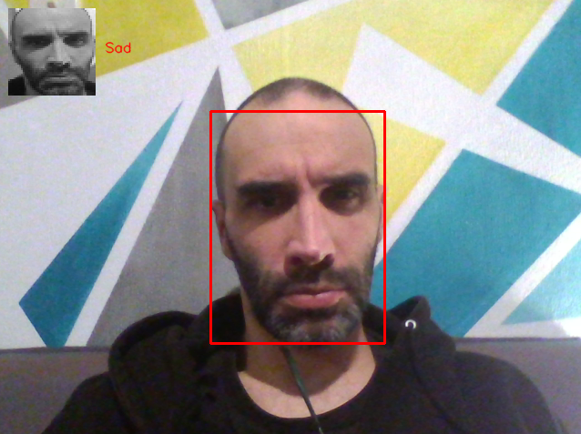

## Summary

This project is my Capstone project for the ML-bootcamp (with Alexey Grigorev).
The goal is to gather some experience in various steps of ML pipeline.

I selected the FER2013 *(Facial Expression Recognition)* dataset in order to try solving an `Image Multiclass Classification` problem. Such a problem is interesting because it tries to classify isolated faces among several expressions (7 on this dataset).


Such models can probably be used in:
- the virtual reality or the virtual meetings with avatars (to transcribe the facial expression to the other participants),
- the video games (so that the game can know if it must adjust to the player or not)
- the interactive street advertisements (to evaluate how the public react when exposed to a given product),
- the shows (to evaluate the appreciation of the movie, theater show etc.)
- maybe even to school (so that teachers can know if a kid has a problem, is distracted etc...)
- ...

The full set consists of 35,887 samples, and the data consists of 48x48 pixel grayscale images of faces. The faces have been automatically registered so that the face is more or less centered and occupies about the same amount of space in each image.

It has two columns, "emotion" and "pixels". The "emotion" column contains a numeric code ranging from 0 to 6, inclusive, for the emotion that is present in the image. The "pixels" column contains a string surrounded in quotes for each image. The contents of this string a space-separated pixel values in row major order.


### Dataset source

This dataset was prepared by Pierre-Luc Carrier and Aaron Courville, as part of an ongoing research project.
The dataset is too large to be hosted on github, but it can be downloaded from Kaggle:

- https://www.kaggle.com/c/challenges-in-representation-learning-facial-expression-recognition-challenge
- https://www.kaggle.com/c/challenges-in-representation-learning-facial-expression-recognition-challenge/data?select=fer2013.tar.gz


## Cloud demo

One can try the application here:
https://ml-fer2013.herokuapp.com/input


## Clone repo

```bash
>> git clone https://github.com/Valkea/ML_Facial_Expression_Recognition.git
>> cd ML_Facial_Expression_Recognition
```

## Initialize the virtual environment

Install pipenv if needed
```bash
>> pip install pipenv
```

Start the pipenv virtual environment:
```bash
>> pipenv shell
```
*(If it doesnt' work due to the Python 3.8 requirement, you can edit the Pipfile with you own version. I think it should work with any Python3 version has I didn't used any specific function or method.)*

Install the production + developement dependencies:
```bash
(venv) >> pipenv install
(venv) >> pipenv install --dev
```
## Clone data and models
Now let's collect the dataset and the models from the DVC hosting:
```bash
>> dvc remote add origin https://dagshub.com/Valkea/ML_Facial_Expression_Recognition.dvc
>> dvc pull -r origin
```

If it doesn't works for you, you can grab the .csv file here:
- https://www.kaggle.com/c/challenges-in-representation-learning-facial-expression-recognition-challenge/data?select=fer2013.tar.gz

## Running jupyter-notebook


```bash
>> jupyter notebook
or
>> jupyter notebook notebook-01-EDA.ipynb
```

*(The notebook menu was created using some HTML, and the GitHub preview doesn't render all of them. But it should work locally)


This project focused on Convolutional Neural Network (CNN) architectures, but several other classifications methods were also tried for comparisons.

The exported model can be tested using:
- the 'Load Models.ipynb' notebook
- the 'test_camera.py' python script (you need a working webcam, but it works with several users at the same time)
- the 'test_image_local.py' python script (just in case you don't have a webcam)
- the 'test_image_remote.py' python script (it sends a picture to the AWS lambda function in order to get a prediction from the remotly hosted model)


## Running locally using python scripts
Start Flask development server:
```bash
(venv) >> python fer2013_server.py
```

Stop with CTRL+C *(once the tests are done from another terminal...)*


### Tests
One can check that the server is running by opening the following url:
http://0.0.0.0:5000/

Then by submitting various predefined pictures, various results should be displayed.

For conveniance, I created two scripts in order to test prediction by sending a string (same as in the dataset) or a picture.

#### Test from a space separated string containing 2304 grayscale values
```bash
>> python test_from_string.py 
```
This should return an "Angry" label for the given face.


#### Test from the (above) pictures
```bash
>> python test_from_image.py medias/Angry.jpg
>> python test_from_image.py medias/Fear.jpg
>> python test_from_image.py medias/Sad.jpg
>> python test_from_image.py medias/Happy.jpg
>> python test_from_image.py medias/Neutral.jpg
```

#### Test from the webcam
```bash
(venv) >> python test_from_camera.py 
```
*/!\ You need to run it from the pipenv shell*

Press any key to stop the program.

This script is built using the [MTCNN library](https://github.com/kpzhang93/MTCNN_face_detection_alignment) to locate the face in each picture and then the captured face is used to predict expression from my FER model.

It can handle several people at the same time (up to 3), but I purposely limited the framerate so that it should be usable with or without GPU (MTCNN requires a lot of computation).




##### Open-CV potential problem
Sometimes OpenCV needs to be reinstalled *(because it can't find a given function used for image transformation)*, if this happens you can try to reinstall it:

```bash
(venv) >> pipenv uninstall opencv-python 
(venv) >> pipenv install opencv-python 
```

## Docker

### Building a Docker image

```bash
>> docker build -t fer2013-prediction .
```

### Running a local Docker image

```bash
>> docker run -it -p 5000:5000 fer2013-prediction:latest
```

Stop with CTRL+C

Then one can run the same test steps as before... (open input url or run test_image_local.py)

### Pulling a Docker image from Docker-Hub

I pushed a copy of my docker image on the Docker-hub, so one can pull it:

```bash
>> docker pull valkea/fer2013-prediction:latest
```

But this command is optionnal, as running it (see below) will pull it if required.

### Running a Docker image gathered from Docker-Hub

Then the command to start the docker is almost similar to the previous one:

```bash
>> docker run -it -p 5000:5000 valkea/fer2013-prediction:latest
```

Stop with CTRL+C

And once again, one can run the same test steps explained above... (open input url or run test_image_local.py)


## Create a new model file from python script

In order to create a new model .h5 file and a new weights .hdf5 file, one can use the following command:

```bash
>> python model_training.py
```
This will use the default input and out names. But this can be changed using the -s (--source), -d (--destination), -b (--batch_size), -e (--epochs), -se (--steps_per_epoch), -vs (--validation_steps) parameters.

```bash
>> python model_training.py -s IN_NAME -d OUT_NAME -b 64 -e 100 -se 100 -vs 50
```

Then these files can be converted to a .tflite file using the appropriate script:
```bash
>> python model_convert_to_TFLite.py MODEL.h5 WEIGHTS.hdf5
```


## Cloud deployement

In order to deploy this project, I decided to use Heroku.

*Here is a great ressource to help deploying projects on Heroku:*
https://github.com/nindate/ml-zoomcamp-exercises/blob/main/how-to-use-heroku.md

So if you don't already have an account, you need to create one and to follow the process explained here: https://devcenter.heroku.com/articles/heroku-cli


#### Create project on Heroku

Once the Heroku CLI is configured, one can login and create a project using the following commands (or their website):

```bash
>> heroku login
>> heroku create ml-fer2013
```


#### Push project to Heroku

Then, the project can be compiled, published and ran on Heroku, with:

```bash
>> heroku container:login
>> heroku container:push web -a ml-fer2013
>> heroku container:release web -a ml-fer2013
```


#### Test Heroku's project with a space separated string containing 2304 grayscale values
```bash
>> python test_from_string.py --url https://ml-fer2013.herokuapp.com/predict
```
This should return an "Angry" label for the given face.


#### Test Heroku's project with pictures
```bash
>> python test_from_image.py medias/Angry.jpg --url https://ml-fer2013.herokuapp.com/predict
>> python test_from_image.py medias/Fear.jpg --url https://ml-fer2013.herokuapp.com/predict
>> python test_from_image.py medias/Sad.jpg --url https://ml-fer2013.herokuapp.com/predict
>> python test_from_image.py medias/Happy.jpg --url https://ml-fer2013.herokuapp.com/predict
>> python test_from_image.py medias/Neutral.jpg --url https://ml-fer2013.herokuapp.com/predict
```

Finally, one can send check the logs using:
```bash
>> heroku logs --tail --app ml-fer2013
```

## Clean the virtual environment
If you don't need this project anymore, recall to delete the Pipenv environnement before deleting the folder (otherwise it will remain on your computer).

```bash
(venv) >> exit
>> pipenv --rm
```
